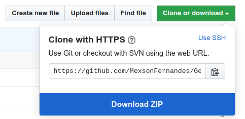

# Generate Passwords BruteForce - Python

A Python module to generate all the possible combination of passwords for performing brute force method.

## Installation: 
Using git
```shell
git clone https://github.com/MexsonFernandes/Generate_Passwords_Brute_Force-Python.git
```
Or download and extract the archive:


Under the repository name, click Clone or download -> Download ZIP. 

Unpack the zip anywhere on your computer. 


## Usage:
main.py takes 4 arguments: 
  * N - number of password character
  * [alphabets](https://docs.python.org/3/library/string.html#string.ascii_letters) (y/n)
  * [special characters](https://docs.python.org/3/library/string.html#string.punctuation) (y/n)
  * [numbers](https://docs.python.org/3/library/string.html#string.digits) (y/n)

This generates a wordlistN.txt and a logN.txt file. 

## Arguments:
  * number of password character
  * alphabets (y/n)
  * special characters (y/n)
  * numbers (y/n)
  
 ## How to run(sample):
  * ``python main.py 4 y y y``
  
Explanation: generate 4 length passwords containing alphabets, special characters and numbers.

## Example:
We want to generate all possible combinations of passwords 3 characters long, containing lower- and uppercase letters, special characters and numbers. 

We would navigate to the Generate_Passwords_Brute_Force-Python folder and run: 
```shell
python main.py 3 y y y
```
The output should be
```
830584
processing...

830584
```
In this case the passwords are saved in wordlist3.txt and a short log in log3.txt. 

## License
[MIT](https://choosealicense.com/licenses/mit/)

